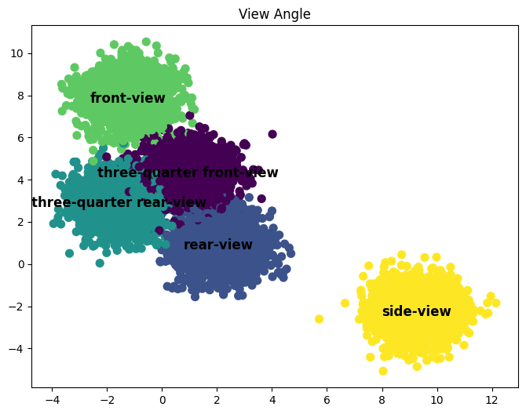

# ALGOTIVE KlusterCar App 🚗: Sorting Vehicles Images with a Textual Twist

## 📣 Try

Experience the ease of clustering vehicle images with our intuitive drag-and-drop interface. Simply drag an image into the designated drop zone and let our AI-powered system analyze and sort the vehicle based on its visual and textual features, such as color, type, and orientation.

- Live App here: [ALGOTIVE KlusterCar App](https://algotive-kluster-cars-v1-5rxxsuinqa-zf.a.run.app/)

<div align="center">
  
</div>

## 📕 Overview

This innovative clustering solution is designed for the automatic grouping of vehicle images obtained from surveillance camera footage. By employing the synergy of vision-language models (VLMs) and large language models (LLMs), we follow the IC|TC: Image Clustering Conditioned on Text Criteria that introduces a novel approach to image clustering [(arXiv link)](https://arxiv.org/abs/2310.18297). It not only prioritizes accuracy but also user-defined flexibility, allowing for the grouping of images based on a variety of text-based features such as color, orientation, and vehicle type. The system is capable of adapting to different features, showcasing a versatile application in the realm of automated surveillance and data organization.

Our approach showcases its capability in the sample image below, where various vehicle images are automatically classified into distinct categories. The system identifies and groups vehicles based on:

- **Vehicle Color**: Examples include white, silver, black, dark gray, blue, yellow, green, orange and red.
- **Vehicle Type**: Categorization into types such as bus, van, sedan, hatchback, pickup, truck, coupe and SUV.
- **View Angle**: Classifying the viewpoint of the vehicle image, such as front-view, rear-view, three-quarter rear-view, three-quarter front-view and side-view.
- **Roof Features**: Classifying the roof such as none, sunroof, roof rails, cargo or roof rack.

This visual summary underscores the app's proficiency in interpreting and sorting images based on the extracted features, demonstrating a high level of accuracy and detail in its classification process.

<div align="center">
  
</div>

## 🔍 Problem Statement

In the bustling intersections of modern cities, surveillance cameras are the ever-watchful eyes, capturing every moment on the streets. Among the myriad of images collected, vehicles of all shapes and colors zip through the frame, each with a story to tell. The challenge we faced was not just to make sense of this vehicular mosaic but to bring order to the chaos. How do we group these mechanical marvels, not by the loudness of their horns or the brightness of their headlights, but by features that can be described in words? The ALGOTIVE KlusterCar App rises to the occasion, clustering with a clever textual twist, where traditional algorithms merely spin their wheels.

## 💬 Solution Approach

1️⃣ **Image Description Extraction**: We began by extracting comprehensive descriptions for each image using advanced VLMs. This process transformed visual data into descriptive text, laying the groundwork for further analysis.

2️⃣ **Label Derivation**: With the image descriptions in hand, we then utilized LLMs to intelligently generate labels. These labels distilled the essence of each image into textual features that could be used for clustering.

3️⃣ **Label Clustering**: The derived labels were grouped using LLMs, allowing us to organize the dataset into a predetermined number of clusters. This step involved fine-tuning the models to balance the granularity and coherence of the groupings.

4️⃣ **Image Classification**: Post-clustering, the images were categorized according to the groupings, ensuring that each cluster was homogenous in terms of the selected feature.

5️⃣ **Performance Evaluation**: To quantify the efficacy of our system, we employed the Hungarian Matching algorithm, which provided us with metrics such as Accuracy, Adjusted Rand Index (ARI), and Normalized Mutual Information (NMI).

## 💬🖍 Detailed Solution Approach

The methodology we employed to tackle the image clustering challenge is a testament to the versatility and power of combining different AI domains. Here's an in-depth look at our approach:

### 1. Image Description Extraction

The process begins with `visual_insight_generator.py`, a script that utilizes Salesforce's BLIP-2 model to extract detailed textual descriptions from vehicle images. This Vision-Language Model (VLM) skillfully interprets the visual content of each image, converting it into rich, descriptive text. The script iterates over images in a specified folder, translating each image into a narrative, which is then saved in JSONL format for further processing. Its efficient error management and dynamic path management make it adaptable for various systems, transforming static images into narratives ready for clustering.

_Script:_ `visual_insight_generator.py`

### 2. Label Derivation

Next, the `label_generator.py script takes these descriptive texts and converts them into actionable data. It uses two powerful language models, GPT for general text generation and LLAMA for specialized prompts, to analyze the image descriptions and distill them into concise labels. This script is pivotal in bridging the gap between raw descriptions and clustered data, ensuring that the labels are not only accurate but relevant for the clustering process. The output is an organized set of labels, each a condensed version of the image's story, prepared for the clustering phase.

_Script:_ `label_generator.py`

### 3. Label Clustering

The `label_clustering.py script then organizes these labels into coherent groups. It filters the labels to include only the most relevant ones for clustering, using either GPT or LLAMA models based on the setup. This script is designed to understand the context and nuances of each label, grouping them into classes that represent distinct groups of vehicle images. Its adaptability, dynamic environment variable loading, and robust model version handling ensure efficient and reliable clustering.

_Script:_ `label_clustering.py`

### 4. Image Classification

In this step, `image_classifier.py assigns each image to a cluster based on the derived labels. The script reads the initial descriptions and prompts the language model to classify the images into the appropriate clusters. Its methodical approach, including efficient data handling and dynamic configuration, ensures that each image is accurately categorized based on its features. This classification transforms abstract labels into tangible groupings of images, ready for practical use or further analysis.

_Script:_ `image_classifier.py`

### 5. Performance Evaluation

Finally, the `performance_evaluator.py` script assesses the accuracy and effectiveness of the clustering process. It compares the classified images with pre-defined classes, using the Hungarian Matching algorithm for a precise evaluation of clustering performance. The script calculates statistical measures like silhouette score and Calinski-Harabasz index, providing a comprehensive assessment of the clustering quality. The result is a detailed performance report, highlighting the system's strengths and potential areas for improvement.

_Script:_ `performance_evaluator.py`

## 📗 Results

The system exhibited high accuracy and outperformed baseline methods in clustering images based on various text criteria. Detailed results and performance metrics for View Angle are provided, showcasing the system's effectiveness.

<div align="center">
  
</div>

| Metric                  | Value | Interpretation                                                                                                                                                                    |
| ----------------------- | ----- | --------------------------------------------------------------------------------------------------------------------------------------------------------------------------------- |
| Silhouette Score        | 0.627 | Indicates strong cohesion and separation; vehicle images are well-grouped by view angle.                                                                                          |
| Calinski-Harabasz Index | 55161 | Higher values mean clusters are dense and well separated, suggesting tight grouping within view angle clusters and clear distinction between them.                                |
| Davies-Bouldin Index    | 0.52  | Lower values indicate better clustering; implies that clusters are well separated from each other, and the algorithm has effectively distinguished between different view angles. |

Based on these metrics, we can conclude that the clustering algorithm performed well in segmenting the vehicle images by their view angles, with clear differentiation between the various views. This suggests that the approach used is effective for this particular application.

## 🛠 Deployment

The model is optimized for production deployment, focusing on improving latency and throughput. A Docker app, as demonstrated in the provided screenshot, is used for the production-like environment, taking advantage of its containerization features for easy scalability and replication.

<div align="center">
  
</div>

The ALGOTIVE KlusterCar App is deployed with a robust backend service that includes an API endpoint for image analysis. Below is the documentation for using the API:

### API Endpoint: `/analyze-image`

This endpoint accepts `POST` requests containing an image file and returns a JSON response with the classified features of the vehicle in the image.

#### Request

- **Method**: `POST`
- **Endpoint**: `/analyze-image`
- **Content-Type**: `multipart/form-data`
- **Body**:
  - `image`: The image file to be analyzed.

#### Response

A successful request returns a `200 OK` status with a JSON payload containing the classified features of the vehicle. If the request does not contain an image or another error occurs, it will return a `400 Bad Request` status with an error message.

##### Example Response:

```json
{
  "vehicle_color": "yellow",
  "vehicle_type": "truck",
  "view_angle": "front-view",
  "roof_features": "none"
}
```

### API Endpoint Performance

During testing, our `/analyze-image` endpoint exhibited an response time of **3.91 seconds**. This metric reflects the latency from the instant a POST request with an image is sent to the server to the moment a response is received.

#### Latency:

- **Response Time**: The API endpoint has an average latency of 3.91 seconds. While this may be suitable for non-time-critical applications, efforts to optimize the server's response time are ongoing to enhance the user experience for more time-sensitive use cases.

Further optimization strategies are being considered to reduce this latency, including but not limited to:

- Refactoring the code to improve efficiency.
- Upgrading server hardware or increasing bandwidth.
- Implementing asynchronous processing to handle requests more quickly.

## 📃 Repository Structure

- `data/`: Contains the dataset of car images used for model training and evaluation.
- `deployment/`: Contains the necessary files and scripts for deploying the model, including Docker configuration files.
- `figures/`: Includes any figures, charts, and images generated during analysis or as part of the project's results.
- `src/`: Holds the source code for the project, with scripts for each step of the clustering and classification process.
- `utils/`: Provides utility scripts and functions that support the main processes, like argument parsing and LLM interaction utilities.
- `challenge_instructions.txt`: Instructions or notes regarding the image clustering challenge.
- `visual_insight_generator.py`: Generates descriptive insights from images (STEP 1).
- `predictive_label_analyzer.py`: Analyzes and predicts labels for the images (STEP 2).
- `cluster_label_aggregator.py`: Handles the aggregation of labels into clusters (STEP 3).
- `classifier.py`: The script responsible for the classification step in the clustering process (STEP 4).
- `measuring_acc.py`: Evaluates the clustering accuracy and other performance metrics (STEP 5).

## 🤓 Contributions

We followed best practices in coding and repository contributions, including descriptive commit messages and well-organized scripts.

## 🤯 Research and Creativity

This project stands out for its novel use of text criteria in image clustering and the creative application of language models to derive meaningful image groupings.

## 💚 Acknowledgements

This project, ALGOTIVE KlusterCar App, draws inspiration from the groundbreaking work detailed in "Image Clustering Conditioned on Text Criteria" by Sehyun Kwon, Jaeseung Park, Minkyu Kim, Jaewoong Cho, Ernest K. Ryu, and Kangwook Lee. The paper provides a solid foundation for our approach and has been instrumental in guiding our methodology.

For those interested in delving deeper into the research that underpins our work, we encourage you to read the full paper, available on [arXiv](https://arxiv.org/pdf/2310.18297.pdf).
