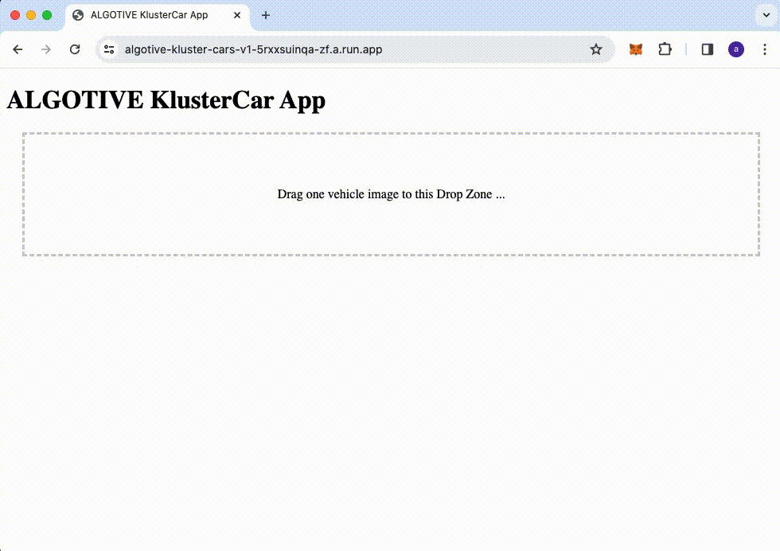

# ALGOTIVE KlusterCar App

## Sorting Vehicles Images with a Textual Twist

### Overview

This innovative clustering solution is designed for the automatic grouping of vehicle images obtained from surveillance camera footage. By employing the synergy of vision-language models (VLMs) and large language models (LLMs), we follow the IC|TC: Image Clustering Conditioned on Text Criteria that introduces a novel approach to image clustering [arXiv Link](https://arxiv.org/abs/2310.18297). It not only prioritizes accuracy but also user-defined flexibility, allowing for the grouping of images based on a variety of text-based features such as color, orientation, and vehicle type. The system is capable of adapting to different features, showcasing a versatile application in the realm of automated surveillance and data organization.

### Problem Statement

In the bustling intersections of modern cities, surveillance cameras are the ever-watchful eyes, capturing every moment on the streets. Among the myriad of images collected, vehicles of all shapes and colors zip through the frame, each with a story to tell. The challenge we faced was not just to make sense of this vehicular mosaic but to bring order to the chaos. How do we group these mechanical marvels, not by the loudness of their horns or the brightness of their headlights, but by features that can be described in words? Enter the task of clustering car images based on discernible text-based characteristics — color, orientation, type — a task that traditional clustering algorithms would rev their engines at, but one that our ALGOTIVE KlusterCar App tackles with a textual twist.

### Solution Approach

The methodology we employed to tackle the image clustering challenge is a testament to the versatility and power of combining different AI domains. Here's an in-depth look at our approach:

Image Description Extraction: We began by extracting comprehensive descriptions for each image using advanced VLMs. This process transformed visual data into descriptive text, laying the groundwork for further analysis.

Label Derivation: With the image descriptions in hand, we then utilized LLMs to intelligently generate labels. These labels distilled the essence of each image into textual features that could be used for clustering.

Label Clustering: The derived labels were grouped using LLMs, allowing us to organize the dataset into a predetermined number of clusters. This step involved fine-tuning the models to balance the granularity and coherence of the groupings.

Image Classification: Post-clustering, the images were categorized according to the groupings, ensuring that each cluster was homogenous in terms of the selected feature.

Performance Evaluation: To quantify the efficacy of our system, we employed the Hungarian Matching algorithm, which provided us with metrics such as Accuracy, Adjusted Rand Index (ARI), and Normalized Mutual Information (NMI).

### Results

The system exhibited high accuracy and outperformed baseline methods in clustering images based on various text criteria. Detailed results and performance metrics are provided, showcasing the system's effectiveness.

### Deployment

The model is optimized for production deployment, focusing on improving latency and throughput. A Docker app, as demonstrated in the provided screenshot, is used for the production-like environment, taking advantage of its containerization features for easy scalability and replication.

### Repository Structure

src/: Source code implementing the IC|TC system.
notebooks/: Jupyter notebooks for experimentation and result analysis.
data/: Sample data used for model training and testing.
models/: Trained models and serialization files.
app/: Docker app for deployment.

### Usage

Instructions for setting up the environment, downloading the dataset, training the model, and deploying the Docker app are provided.

### Contributions

We followed best practices in coding and repository contributions, including descriptive commit messages and well-organized branches.

### Research and Creativity

This project stands out for its novel use of text criteria in image clustering and the creative application of language models to derive meaningful image groupings.

### Acknowledgements

Credit is given to the authors and contributors of the foundational models and datasets used in this project.
